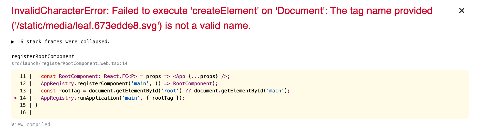

# React Native SVG Transformer (Not working, reproduction)

The steps I took to make this repo:

```
expo init my-app --npm
```

```
cd my-app
```

```
expo install react-native-svg
```

```
npm i -D react-native-svg-transformer
```

create metro.config.js file using the content here https://github.com/kristerkari/react-native-svg-transformer#for-expo-sdk-v4000-or-newer

add declarations.d.ts file using the content here https://github.com/kristerkari/react-native-svg-transformer#using-typescript

```
npm start
```

_notice an error message_, the `@expo/metro-config` package imported by `metro.config.js` does not exist\*

```
npm i -D @expo/metro-config
```

```
npm start
```

click Run in web browser (everything is now good!)

add an svg icon like so https://github.com/willtpwise/react-native-svg-transformer__not-working/blob/6a111d2c545c6e8365913be289f446f131a24907/App.tsx#L4

return to browser (everything is not good!)


